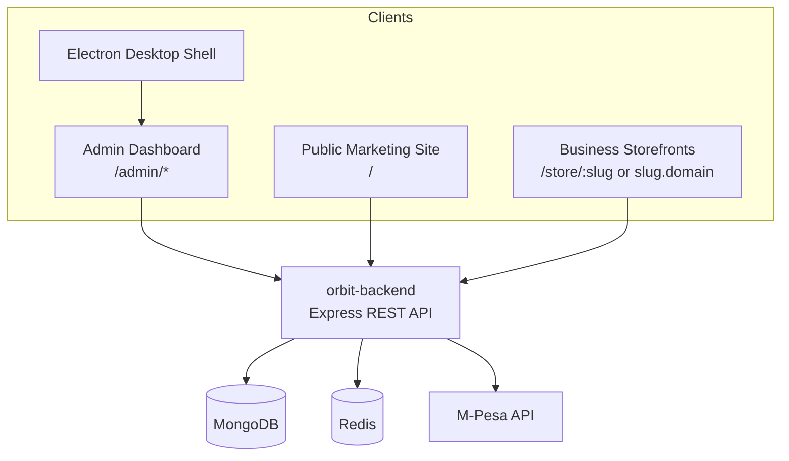
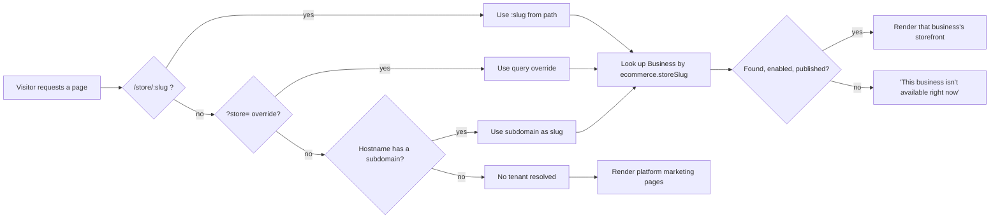
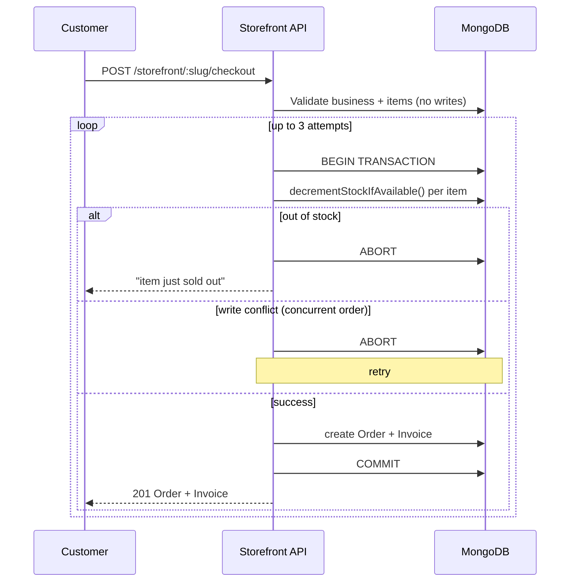

# Orbit — Multi-Tenant Retail & Ecommerce Platform

A multi-tenant platform where each **business** manages its own stores, inventory, sales and staff, and can optionally turn on a public **online storefront** so its customers can browse products and place orders directly.

## Terminology

| Term | Meaning |
|---|---|
| **Business** | The tenant/company itself. Owns everything else. |
| **Store** | A physical/operational location belonging to one business. A business can have many. |
| **Storefront** | A business's *online* sales channel (guest checkout, orders, invoices) — not tied to a physical Store. |

## Repository layout

| Path | What it is |
|---|---|
| `orbit-backend/` | Express + MongoDB REST API |
| `orbit-frontend/` | React/Vite app: admin dashboard, marketing site, business storefronts |
| `orbit-admin/` | Electron desktop shell that loads the admin dashboard |
| `universal-main-frontend/` | Experimental scaffold, not wired into the rest of the system |

## Architecture



## Multi-tenant storefronts

**Tenant resolution** — a storefront request resolves to a business in this order: `/store/:slug` path → `?store=` query override (local dev) → subdomain of the hostname.



**Checkout** — stock decrement, order creation, and invoice creation happen in one MongoDB transaction, with an atomic conditional stock update so concurrent checkouts can't oversell, retried on write conflict:



## Getting started

```bash
git clone https://github.com/Ritahchanger/orbit.git
cd orbit
cd orbit-backend && npm install && cd ..
cd orbit-frontend && npm install && cd ..
```

**`orbit-backend/.env`** (see `.env.example` for the full list):
```env
PORT=5000
MONGO_URI=mongodb://127.0.0.1:27017/orbitdb   # run as a replica set — checkout uses transactions
JWT_SECRET=replace_me
FRONTEND_URL=http://localhost:5173
```

**`orbit-frontend/.env`**:
```env
VITE_API_BASE_URL=http://localhost:5000/api/v1/
```

```bash
# orbit-backend/
node src/seeders/admin.seed.js
node src/permissions/seeders/permissions.seed.js
node src/permissions/seeders/roles.seed.js
npm run dev            # http://localhost:5000

# orbit-frontend/
npm run dev             # http://localhost:5173
```

Default superadmin (from `admin.seed.js` — change before deploying anywhere real):
```
superadmin@orbit.com / MyOrbitSecureSuperAdmin123!
```

To try a business's storefront locally, give it `ecommerce.enabled`, `ecommerce.isPublished`, and an `ecommerce.storeSlug`, then visit `http://<storeSlug>.localhost:5173/products` (any `*.localhost` subdomain resolves to `127.0.0.1` automatically).

## Roles

Five tiers, seeded in `permissions.seed.js` / `roles.seed.js`: **Staff** (4, read-only) → **Cashier** (5) → **Manager** (7) → **Admin** (9) → **Superadmin** (10, everything). Full matrix in `orbit-frontend/src/config/routes.config.jsx`.

## API (representative)

```
POST   /auth/login
GET    /business/ecommerce-settings          Admin/Superadmin
PATCH  /business/ecommerce-settings          Admin/Superadmin

GET    /storefront/:slug                      Public
GET    /storefront/:slug/products              Public
POST   /storefront/:slug/checkout              Public

GET    /orders
GET    /orders/customers
PATCH  /orders/:id/status

GET    /invoices
POST   /invoices/standalone
POST   /invoices/from-sale/:transactionId
```

All routes are mounted under `/api/v1` — see `orbit-backend/src/server.js` for the full table.

## Deployment

- `deploy.sh` — rsyncs backend + built frontend to a remote server over SSH
- `orbit-backend/ecosystem.config.js` — PM2 process config (`pm2 start ecosystem.config.js --env production`)
- `orbit-frontend`: `npm run build`, serve `dist/` behind any reverse proxy

For subdomain-based storefronts in production: point wildcard DNS (`*.your-domain.com`) at the server and make sure the reverse proxy forwards the original `Host` header — CORS and tenant resolution both depend on it.

## Testing

No automated test suite yet. Verification has been manual (`node --check`, direct `curl` calls including deliberate concurrent-request races against checkout, `vite build`).

## Known gaps

- No idempotency key on checkout — a retried/duplicated request can create a duplicate order
- No real payment gateway — payment method is recorded, not processed
- No custom-domain support for storefronts (subdomain-of-platform-domain only)
